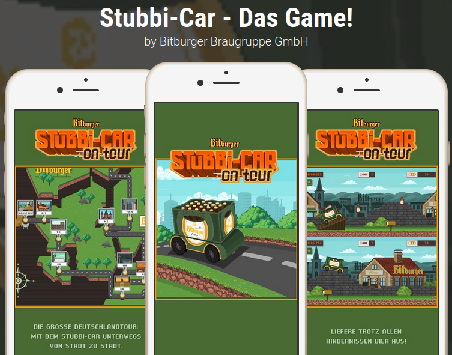

<h1 align="center">Hi 👋, I'm Thomas</h1>
<h3 align="center">A software developer and Unity enthusiast from Germany!</h3>

- 👯 I’m looking to collaborate on **Unity projects**

- 💬 Ask me about **Business Central, Unity, and Educational Game Development**

- 🎓 Currently studying **Educational Technology (M.Sc.)**, combining computer science, pedagogy, and psychology

- ⚡ Fun fact: **I have 10 pets — 2 cats, 2 dogs, 4 rabbits, and 2 pigs — and I’m building a small animal sanctuary**

- 🎮 My current favorite games are **Path of Exile** and **Satisfactory**

---

<h3 align="left">Connect with me:</h3>

---

## 🧑‍💻 Professional Experience

### 🎮 Unity Game Developer — Edurino GmbH (2023–2025)
At Edurino, I developed several educational minigames totaling around 30 minutes of gameplay each. I collaborated closely with game designers, content creators, artists, and tech artists. My responsibilities included implementing complex game logic, multi-touch input, audio and video integration, and content sequencing. I helped maintain and extend our CI pipeline and refactored legacy code for long-term maintainability. I also took care of scene generation and scene handling, introduced and streamlined a low-code workflow tailored to our needs, and ensured efficient system integration. In addition to development, I actively supported onboarding of new team members and contributed to improving team-wide development practices.

### 🧩 Software Developer — ENKO Software GmbH & Co. KG (2020–2023)
Initially led the redevelopment of a mobile game project. Later, I became lead developer in a five-person team tasked with customizing Microsoft Business Central for local clients. My responsibilities included migrating business processes from Excel to Business Central, development in AL, and setting up DevOps workflows using Git and Docker. I also trained colleagues and mentored a trainee.

### 🎓 Developer & Team Lead — Student Projects (2015–2019)
During my studies, I participated in and led various software projects. Roles varied between team leadership and development. One of the highlights was my bachelor thesis, where I created a 2D ecosystem simulation with AI agents using the NEAT algorithm in Unity.

---

## 🛠️ Skills & Technologies

- Unity (C#)
- Git, Docker, Azure DevOps
- Business Central / AL
- JetBrains Rider
- Obsidian.md
- LaTeX
- Educational Game Design
- Visual Studio Code
- Cross-functional Team Collaboration

---

## 🧪 Projects

### [Stubbi-Car (2020)](https://apps.apple.com/us/app/stubbi-car-das-game/id1508323525)
A side-scrolling one-tap game developed for Bitburger. I was the sole developer responsible for the full technical implementation.

I developed the complete game loop and implemented a customizable car system with varying physics depending on the vehicle's state. The game features multiple interactive item types, quick time event mechanics, an online high score system, ghost driving, and full account handling with persistent data. I also built a scrolling and unlockable world map, added multi-touch support, and handled the porting process to both Android and iOS platforms.

### [Bibitsimulator (2019)](https://github.com/LauxThomas/Bachelor_AI_ecosystem)
Bachelor thesis project: A 2D autonomous ecosystem with NEAT-based self-learning AI. Includes procedural generation and early Unity DOTS use.

### [Edurino Minigames (2023–2025)](https://apps.apple.com/de/app/edurino/id1576678420)
A collection of educational minigames designed for children. I contributed as the main Unity developer on multiple titles, covering approx. 30 minutes of interactive gameplay each. These projects involved close collaboration with designers and artists, system integration, and workflow automation.

  
🎥 Watch Videos of My Edurino Work

<table>
  <tr>
    <td align="center">
       
      E11 ClockChaos
    </td>
    <td align="center">
       
      E200 lineBlaster
    </td>
    <td align="center">
       
      E9 mindfulMaze
    </td>
    <td align="center">
       
      E201 dataTreasure
    </td>
  </tr>
  <tr>
    <td align="center">
       
      E9 puffyBreath
    </td>
    <td align="center">
       
      E9 thoughtBalloons
    </td>
    <td align="center">
       
      E11 AutorunnerTime
    </td>
    <td align="center">
       
      E201 catfishGarden
    </td>
  </tr>
  <tr>
    <td align="center">
       
      E200 characterWallpaperPuzzle
    </td>
    <td align="center">
       
      E201 digitalDetox
    </td>
    <td align="center">
       
      E11 Around the Clock
    </td>
    <td align="center">
       
      E11 Build a Clock
    </td>
  </tr>
  <tr>
    <td align="center">
       
      E9 Memory Book
    </td>
    <td></td>
    <td></td>
    <td></td>
  </tr>
</table>

### Business Central Customization (2020–2023)
Customized Microsoft Business Central ERP for various clients. My contributions included AL development, Git/Docker-based dev setup, and workflow optimization. I also provided training and led process migration from Excel to Business Central.

📸 *Screenshots and diagrams coming soon...*

---

_Thanks for stopping by!_
