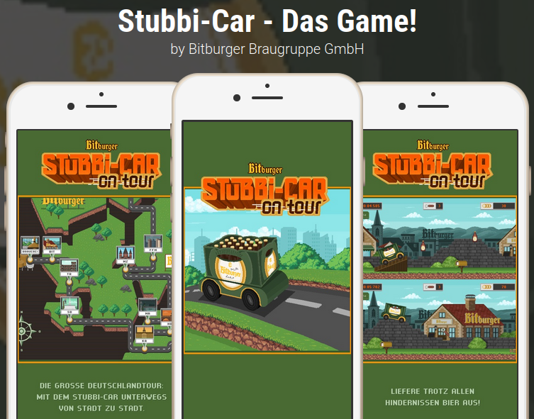

<h1 align="center">Hi 👋, I'm Thomas</h1>
<h3 align="center">Software Developer • Unity Engineer • Educational Technology Student</h3>

- 👨‍💻 Working as a **Unity Game Developer** (Edurino minigames, 2023–2025)
- 🎮 Passionate about **game-based learning, systemic game design, and playful interaction**
- 🚀 Looking to collaborate on **Unity, gameplay systems, and educational tech projects**
- 🎓 Currently studying **Educational Technology (M.Sc.)** — expected graduation **Autumn 2026**
- 🧠 Planning to write my master’s thesis on **gamification in learning environments (e.g., schools)**
- 💬 Ask me about **Unity, Business Central, Educational Game Development, or gameplay systems**
- 🐾 Fun fact: I live with **12 rescue animals** — **3 cats, 2 dogs, 5 rabbits, and 2 pigs** — and I'm slowly building a small sanctuary
- 🎮 Favorite games right now: **Path of Exile**, **Satisfactory**

---

<h3 align="left">Connect with me:</h3>

---

## 🧑‍💻 Professional Experience

### 🎮 Unity Game Developer — Edurino GmbH (2023–2025)
At Edurino I developed **~15 educational minigames**, each contributing around **30 minutes of high-quality gameplay** shipped to thousands of families.  
My work included:

- Implementing **core gameplay**, multi-touch interactions, and accessible input systems  
- Integrating **audio, video, animations, and sequenced content**  
- Maintaining and extending our **CI pipeline**  
- Refactoring and stabilizing legacy systems for long-term scalability  
- Building **scene-generation systems** and streamlining **low-code tools** for content teams  
- Improving onboarding workflows and supporting new developers  
- Collaborating closely with designers, artists, content authors, and tech art to deliver polished experiences  

I also worked on:
- **Catfish Garden** (incl. solving major DataTreasure issues)  
- **Burping AI**, a minigame prototype involving emoji-combination logic and interactive character feedback  
- Internal tooling and workflow automation to support large content pipelines  

### 🧩 Software Developer — ENKO Software GmbH & Co. KG (2020–2023)
- Led a **mobile game redevelopment project** as the first major assignment  
- Later became **lead developer** in a 5-person team customizing **Microsoft Business Central**  
- Implemented AL extensions, designed DevOps workflows (Git, Docker), and migrated business processes from Excel  
- Mentored colleagues and trained a new trainee  
- Managed customer-specific adaptations and long-term maintenance  

### 🎓 Developer & Team Lead — University Projects (2015–2019)
- Participated in and led several software engineering projects  
- Built a **2D ecosystem simulation** for the bachelor thesis, using Unity + NEAT for self-learning AI agents  
- Early experimentation with Unity DOTS and procedural generation  

---

## 🛠️ Skills & Technologies

- **Unity (C#)** — gameplay systems, input, UI, optimization, prototyping  
- **Git, Docker, Azure DevOps**  
- **Business Central (AL)** customization  
- **Educational Game Design & Instructional Design principles**  
- **JetBrains Rider**, VS Code, LaTeX, Obsidian  
- **Collaborative cross-functional development** (design, art, content, tech art)

---

## 🧪 Projects

### 🎮 Edurino Minigames (2023–2025)
I contributed as the main Unity developer on many minigames across the Edurino product lineup.  
Each project involved system design, content tooling, performance tuning, and collaboration with a large interdisciplinary team.

  
🎥 Watch Videos of My Edurino Work

<table>
  <tr>
    <td align="center">
       
      E11 ClockChaos
    </td>
    <td align="center">
       
      E200 lineBlaster
    </td>
    <td align="center">
       
      E9 mindfulMaze
    </td>
    <td align="center">
       
      E201 dataTreasure
    </td>
  </tr>
  <tr>
    <td align="center">
       
      E9 puffyBreath
    </td>
    <td align="center">
       
      E9 thoughtBalloons
    </td>
    <td align="center">
       
      E11 AutorunnerTime
    </td>
    <td align="center">
       
      E201 catfishGarden
    </td>
  </tr>
  <tr>
    <td align="center">
       
      E200 characterWallpaperPuzzle
    </td>
    <td align="center">
       
      E201 digitalDetox
    </td>
    <td align="center">
       
      E11 Around the Clock
    </td>
    <td align="center">
       
      E11 Build a Clock
    </td>
  </tr>
  <tr>
    <td align="center">
       
      E9 Memory Book
    </td>
    <td></td>
    <td></td>
    <td></td>
  </tr>
</table>

---

### 🧾 Business Central Customization (2020–2023)
- AL development for ERP extensions  
- Git/Docker-based DevOps setup  
- Migrated customers' full process pipelines into Business Central  
- Built maintainable workflows and trained team members  

---

### 🚗 Stubbi-Car (2020)
A side-scrolling one-tap mobile game for Bitburger.  

I developed the entire project, including:  
- Customizable vehicle physics  
- Interactive item systems & QTE mechanics  
- Online high score system & ghost driving  
- Persistent user accounts  
- Complete iOS & Android release  
- Scrolling world map and unlock progression  

---

### 🧠 Bibitsimulator (2019)
My bachelor thesis project:  
A **2D evolving ecosystem** powered by **NEAT-based self-learning AI**, procedural terrain, and early Unity DOTS experiments.

GitHub: https://github.com/LauxThomas/Bachelor_AI_ecosystem

---
## 🎯 What I'm Working On Now
- Exploring **new job opportunities** in Unity, educational games, or learning technology  
- Researching topics centered on **gamification** and motivation in learning environments  
- Managing a **week-long digital learning project** for elementary students, using **Minecraft Education** to support younger learners  
- Designing a **university course** future students can take, focused on creating a podcast: planning and conducting interviews, research workflows, structuring timelines, and using **software, hardware, and AI** to enhance production quality  
- Deepening my expertise in **multimedia learning** and applying best practices to strengthen my teaching and instructional design skills  

---

_Thanks for stopping by — feel free to reach out!_
